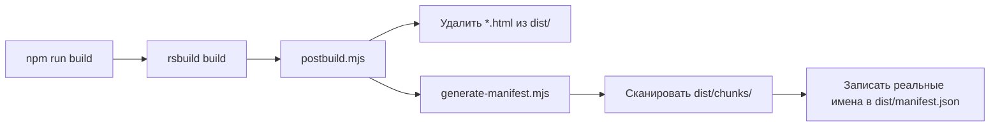

# Rsbuild Chrome Extension — Lazy Loading Config

Референсная конфигурация для **ленивой загрузки (code splitting)** в content script Chrome Extension.
Rsbuild + bootstrap pattern, без crxjs/wxt.

## Архитектура

```
bootstrap.js (classic script, manifest entry, ~150B)
  │
  └─ import(chrome.runtime.getURL('/content.js'))
       │
       content.js (ESM module, Rspack runtime, ~2.4KB)
         │
         ├─ import() → feature-panel.js    ← React UI (lazy)
         │              ├─ React.lazy() → component-heavy-table.js
         │              └─ React.lazy() → component-settings.js
         │
         ├─ import() → feature-scraper.js  ← plain TypeScript (lazy)
         │
         └─ import() → util-heavy-calc.js  ← plain TypeScript (lazy)

         vendor-react.js                   ← react + react-dom (async chunk)
         vendor-lib.js                     ← other npm packages (async chunk)
```

### Двухступенчатая загрузка (ключевое решение)

Content scripts в Chrome загружаются как **classic scripts** (не ESM modules).
Это создаёт две проблемы:

1. `import.meta.url` недоступен — нельзя автоматически определить publicPath
2. Relative `import()` резолвится относительно **URL страницы**, а не расширения

Решение: `bootstrap.js` (classic) загружает `content.js` через
`import(chrome.runtime.getURL('/content.js'))`. После этого `content.js`
выполняется как ESM module, где `import.meta.url` корректно возвращает
`chrome-extension://<id>/content.js` и все relative imports работают.

### Почему Rsbuild, а не Vite?

- `chunkLoading: 'import'` + `chunkFormat: 'module'` — чанки загружаются через
  `import()` в isolated world, а не через `<script>` тег (который выполняется
  в контексте страницы)
- Rspack ecosystem (`webpack-target-webextension`) совместим
- Webpack-like `splitChunks` для точного контроля code splitting

### Скрипты пост-обработки (`scripts/`)

Rsbuild — универсальный веб-бандлер, а не специализированный инструмент для
расширений. После сборки нужно привести `dist/` в вид, который примет Chrome:

**`postbuild.mjs`** — оркестратор, запускается автоматически после `rsbuild build`
через цепочку в `package.json` (`rsbuild build && node scripts/postbuild.mjs`):

1. Удаляет `*.html` из `dist/` — Rsbuild генерирует HTML для каждого entry point,
   но content script не имеет собственной страницы, эти файлы не нужны.
2. Вызывает `generate-manifest.mjs`.

**`generate-manifest.mjs`** — обновляет `web_accessible_resources` в
`dist/manifest.json` реальными именами чанков. Chrome Manifest V3 **не
поддерживает glob-паттерны** (`chunks/*.js`) — каждый файл нужно перечислить
явно. Скрипт сканирует `dist/chunks/`, собирает все `.js` / `.css` / `.wasm`
файлы и записывает их в манифест. Без этого шага динамические `import()` чанков
будут заблокированы браузером.



## Быстрый старт

```bash
npm install
npm run build
```

### Загрузка в Chrome

1. `chrome://extensions/` → Developer mode ON
2. "Load unpacked" → выбрать папку `dist/`
3. Открыть любую страницу → в Console увидишь `[ContentScript] Module loaded via bootstrap`
4. В console вызвать `__extLoadPanel()` для загрузки React панели

## Добавление нового lazy модуля

1. Создай файл в `src/features/` или `src/utils/`
2. Импортируй через `import()` в `src/content/index.ts`:
   ```ts
   const { myFunction } = await import(
     /* webpackChunkName: "feature-my-thing" */
     "../features/my-thing"
   );
   ```
3. Пересобери: `npm run build`

## Структура проекта

```
├── public/
│   ├── bootstrap.js           # Classic script entry (loaded by manifest)
│   └── manifest.json          # Extension manifest template
├── scripts/
│   ├── generate-manifest.mjs  # Auto-update web_accessible_resources
│   └── postbuild.mjs          # Clean HTML + run generate-manifest
├── src/
│   ├── content/
│   │   └── index.ts           # ESM module entry (loaded by bootstrap)
│   ├── features/
│   │   ├── panel.tsx           # React UI panel (lazy)
│   │   ├── scraper.ts          # DOM scraper (lazy, plain TS)
│   │   └── components/
│   │       ├── HeavyTable.tsx  # Sub-component (React.lazy)
│   │       └── Settings.tsx    # Sub-component (React.lazy)
│   └── utils/
│       └── heavy-calc.ts       # Heavy computations (lazy, plain TS)
├── env.d.ts
├── rsbuild.config.ts
├── tsconfig.json
└── package.json
```
